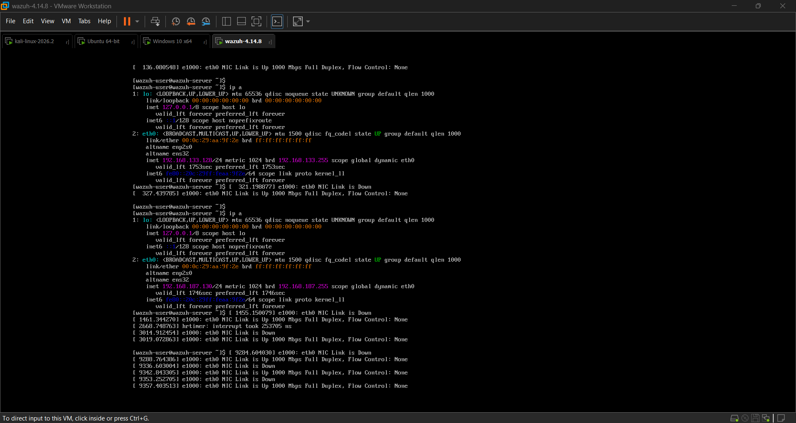
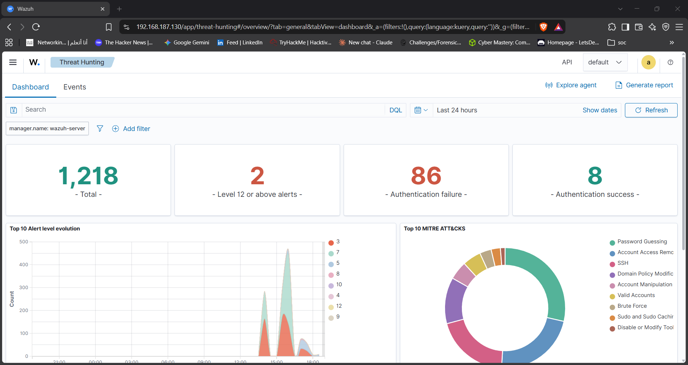
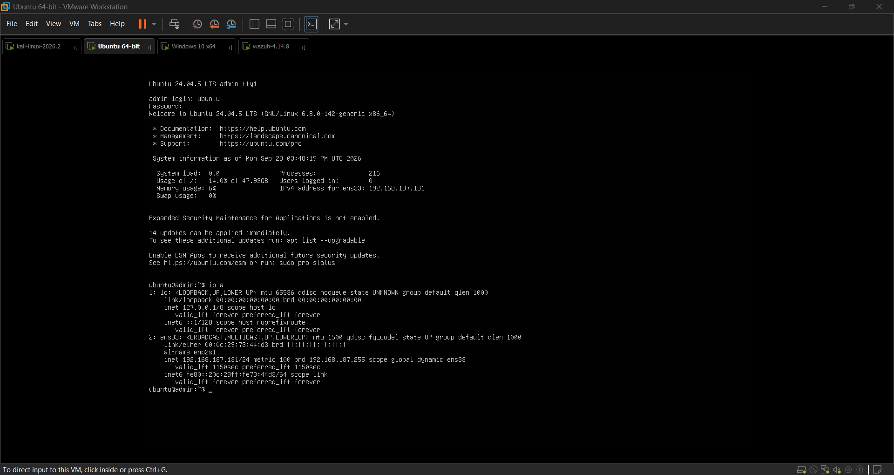
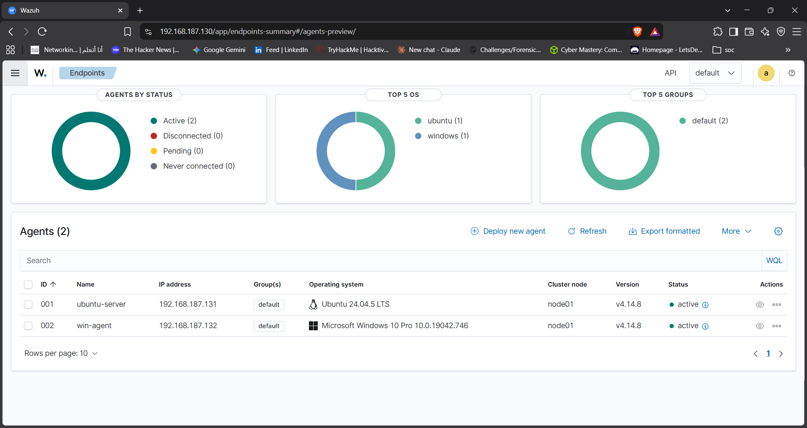
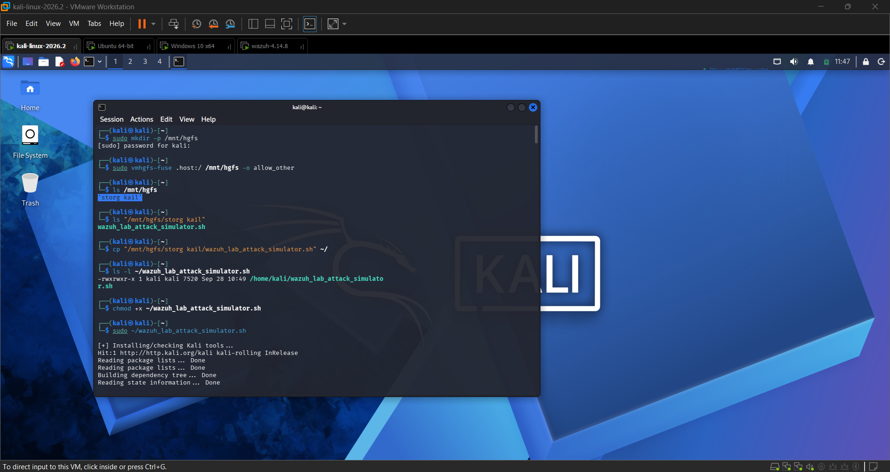
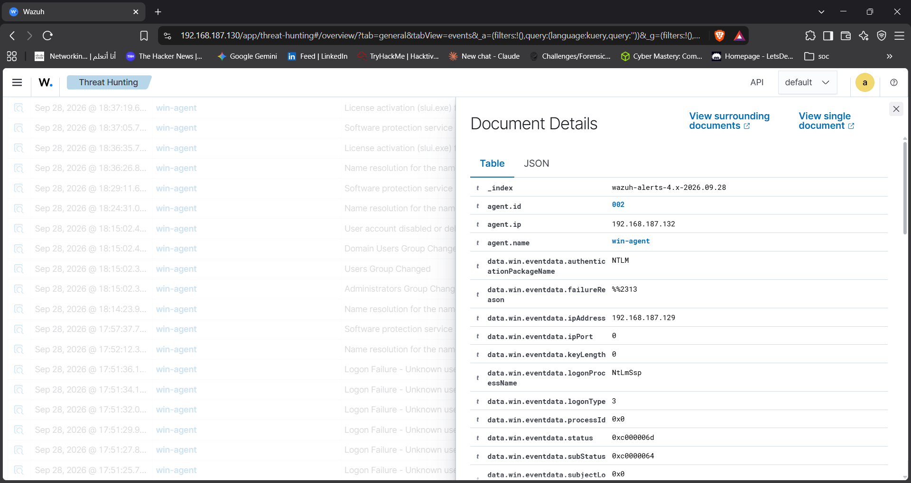
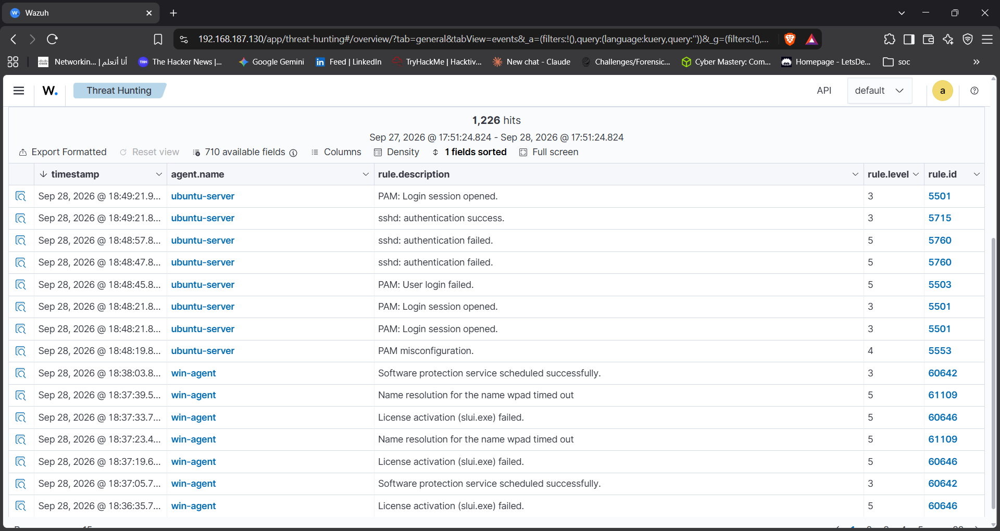
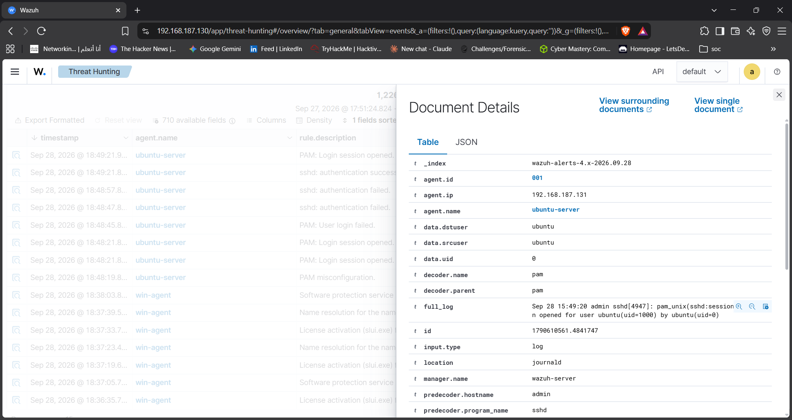
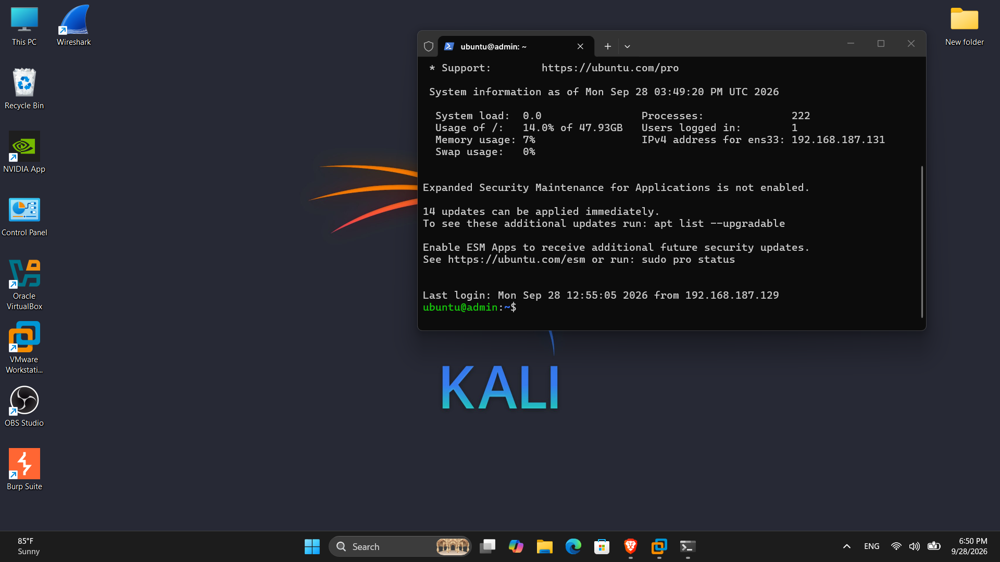

<div align="center">

# 🛡️ Wazuh SOC Home Lab

### Attack Simulation • Detection • Investigation

**A hands-on SOC home lab focused on Wazuh SIEM, attack telemetry, alert investigation, and MITRE ATT&CK mapping.**

</div>

---

## 📌 Project Overview

This project is a **self-built SOC home lab** designed to simulate a real Tier 1 SOC investigation workflow:

```text
Attack
  ↓
Telemetry
  ↓
Detection
  ↓
Alert
  ↓
Investigation
  ↓
Correlation
  ↓
Verdict
```

I deployed **Wazuh SIEM/XDR** with Windows and Linux agents inside an isolated VMware network, generated controlled attack activity from Kali Linux, and investigated the resulting security events through the Wazuh dashboard.

The goal was not simply to generate alerts, but to practice the process of answering:

* What happened?
* Which system was targeted?
* Where did the activity come from?
* What evidence supports the alert?
* Is the activity malicious or expected?
* What should a SOC analyst do next?

> ⚠️ **Lab Scope:** All activity was performed against systems owned and controlled by me inside an isolated lab environment.

---

# 🏗️ Lab Architecture

The lab consists of four virtual machines connected to the same private VMware network.

| System            | OS                 | IP                | Role                         |
| ----------------- | ------------------ | ----------------- | ---------------------------- |
| **Wazuh Server**  | Wazuh 4.14.8       | `192.168.187.130` | SIEM / Detection / Dashboard |
| **Ubuntu Server** | Ubuntu 24.04.5 LTS | `192.168.187.131` | Linux Victim / Wazuh Agent   |
| **Windows 10**    | Windows 10 Pro     | `192.168.187.132` | Windows Victim / Wazuh Agent |
| **Kali Linux**    | Kali Linux         | `192.168.187.129` | Attack Simulation            |

```text
                         ┌──────────────────────┐
                         │     Wazuh Server     │
                         │   SIEM / Dashboard   │
                         │    192.168.187.130   │
                         └──────────┬───────────┘
                                    │
                          Agent Telemetry
                                    │
                 ┌──────────────────┴──────────────────┐
                 │                                     │
        ┌────────▼────────┐                   ┌────────▼────────┐
        │  Ubuntu Server  │                   │    Windows 10   │
        │     Victim      │                   │      Victim     │
        │ 192.168.187.131 │                   │ 192.168.187.132 │
        └────────▲────────┘                   └────────▲────────┘
                 │                                     │
                 └──────────────────┬──────────────────┘
                                    │
                              Attack Traffic
                                    │
                         ┌──────────▼──────────┐
                         │      Kali Linux     │
                         │  Attack Simulation  │
                         │  192.168.187.129    │
                         └─────────────────────┘
```

**Network:** VMware Workstation NAT — `192.168.187.0/24`

### Lab Evidence



*Figure 1 — Wazuh server console (`ip a`) confirming the lab address `192.168.187.130` on `eth0`.*

---

# 🎯 What I Built

The lab was built in several stages:

### 1. SIEM Deployment

* Deployed Wazuh 4.14.8 using the official OVA.
* Imported the appliance into VMware Workstation.
* Configured the lab network.
* Accessed the Wazuh dashboard.



*Figure 2 — Wazuh Threat Hunting dashboard, reachable at `192.168.187.130`.*

### 2. Linux Endpoint

* Installed Ubuntu Server 24.04.5 LTS.
* Installed and configured OpenSSH.
* Installed the Wazuh agent.
* Connected the agent to the Wazuh server.
* Verified the endpoint as **Active**.



*Figure 3 — Ubuntu Server 24.04.5 LTS console with `ip a` showing `192.168.187.131`.*

### 3. Windows Endpoint

* Installed the Wazuh Windows agent.
* Started the `WazuhSvc` service.
* Verified communication through `ossec.log`.
* Confirmed Windows Security Event telemetry in Wazuh.



*Figure 4 — Wazuh Endpoints view: `ubuntu-server` and `win-agent` both **Active** on v4.14.8.*

### 4. Attack Simulation

Kali Linux was used to generate controlled security telemetry using:

* `nmap`
* `hydra`
* `sshpass`
* `netcat`

The activity was intentionally limited to the isolated lab environment.



*Figure 5 — Launching `wazuh_lab_attack_simulator.sh` from the Kali machine.*

---

# 🔎 Detection Scenarios

The following scenarios are being used to validate the lab's detection and investigation capabilities.

| Scenario                    | Target  | Evidence                   | MITRE ATT&CK | Status         |
| --------------------------- | ------- | -------------------------- | ------------ | -------------- |
| SSH failed-logon simulation | Ubuntu  | Wazuh Rules `5710`, `5503` | T1110        | ✅ Completed    |
| Windows baseline telemetry  | Windows | Security Event Logs        | —            | ✅ Completed    |
| RDP failed logons           | Windows | Event ID `4625`            | T1110        | 🔄 In Progress |
| SSH failed logons           | Windows | Event ID `4625`            | T1110        | ⏳ Planned      |
| Local account creation      | Windows | Event ID `4720`            | T1136        | ⏳ Planned      |
| Local group modification    | Windows | Event ID `4732`            | T1098        | ⏳ Planned      |

Evidence from the Windows scenarios so far — failed network logons from Kali against `win-agent`:



*Figure 6 — Windows Security event on `win-agent`: failed NTLM network logon (logon type 3) from `192.168.187.129`.*

---

# 🧪 Completed Investigation

## SSH Brute-Force Simulation

The first completed investigation focused on repeated failed SSH authentication attempts against the Ubuntu server.

### Attack Source

**Kali Linux**

```text
192.168.187.129
```

### Target

**Ubuntu Server**

```text
192.168.187.131:22
```

### Simulation

```bash
for i in {1..8}; do
    ssh -o StrictHostKeyChecking=no wronguser@192.168.187.131 exit
done
```

The username `wronguser` does not exist on the target system, so the activity generates failed authentication telemetry.

---

## 🚨 Wazuh Detection

The resulting events were investigated in the Wazuh dashboard.



*Figure 7 — Wazuh events list: PAM / sshd authentication events from `ubuntu-server`.*

Relevant detections included:

| Wazuh Rule | Detection                             |
| ---------- | ------------------------------------- |
| `5710`     | SSH attempt using a non-existent user |
| `5503`     | PAM user login failed                 |

Example investigation filter:

```text
agent.name: ubuntu-server
AND
rule.groups: authentication_failed
```

---

## 🔬 Investigation

The investigation followed a simple SOC workflow:

```text
Failed Login
     ↓
Identify Username
     ↓
Identify Source IP
     ↓
Identify Target
     ↓
Count Attempts
     ↓
Check Time Window
     ↓
Check Related Events
     ↓
Determine Verdict
```

### Alert Evidence



*Figure 8 — Document Details of an `ubuntu-server` event: agent, decoder (`pam`), `full_log`.*

### Investigation Evidence



*Figure 9 — Ubuntu login banner: `Last login ... from 192.168.187.129` confirms Kali as the source host.*

### Investigation Result

| Field        | Finding                                   |
| ------------ | ----------------------------------------- |
| Source       | Kali `192.168.187.129`                    |
| Target       | Ubuntu `192.168.187.131`                  |
| Protocol     | SSH                                       |
| Port         | TCP/22                                    |
| Username     | `wronguser`                               |
| Attempts     | 8                                         |
| Detection    | Wazuh Rules `5710` / `5503`               |
| MITRE ATT&CK | T1110 — Brute Force                       |
| Verdict      | True Positive — authorized lab simulation |

The important point is that the investigation did not stop at **"an alert exists."**

The source, destination, username, frequency, timing, and related events were checked before reaching the verdict.

---

# 🧠 SOC Investigation Skills Practiced

This project focuses on practical Tier 1 SOC activities.

### Alert Analysis

* Reading Wazuh alerts.
* Understanding rule IDs and severity.
* Identifying the affected endpoint.
* Extracting source and destination information.

### Log Investigation

* Authentication events.
* Linux SSH/PAM logs.
* Windows Security Event Logs.
* Event IDs such as `4624`, `4625`, `4720`, and `4732`.

### Threat Detection

* Identifying repeated authentication failures.
* Separating security events from normal system activity.
* Filtering Wazuh SCA/CIS noise.
* Mapping activity to MITRE ATT&CK.

### Investigation & Correlation

* Source IP analysis.
* Username analysis.
* Attempt counting.
* Time-window analysis.
* Correlating authentication events with subsequent activity.

### Troubleshooting

* Wazuh agent connectivity.
* Windows service configuration.
* OpenSSH deployment.
* Network and port validation.
* VMware network configuration.

---

# 🔍 Wazuh Investigation Cheat Sheet

Useful searches used during the lab:

| Investigation            | Wazuh Query                          |
| ------------------------ | ------------------------------------ |
| Authentication failures  | `rule.groups: authentication_failed` |
| SSH events               | `decoder.name: sshd`                 |
| Ubuntu endpoint          | `agent.name: ubuntu-server`          |
| Windows failed logon     | `data.win.system.eventID: 4625`      |
| Windows successful logon | `data.win.system.eventID: 4624`      |
| Windows account creation | `data.win.system.eventID: 4720`      |
| Local group modification | `data.win.system.eventID: 4732`      |

---

# ⚙️ Attack Simulation Script

To make the testing repeatable, I created:

```text
scripts/wazuh_lab_attack_simulator.sh
```

The script performs controlled phases:

```text
1. Host Discovery
       ↓
2. Service Enumeration
       ↓
3. Port Connectivity Checks
       ↓
4. Failed Authentication Simulation
       ↓
5. DNS / HTTP Activity
       ↓
6. Wazuh Investigation Queries
```

### Safety Controls

The script was intentionally designed for a lab environment.

It:

* Validates that target addresses are private RFC1918 addresses.
* Uses bounded authentication attempts.
* Avoids uncontrolled flooding.
* Pauses between phases.
* Displays the Wazuh query needed to investigate the generated activity.

Example:

```bash
sudo bash scripts/wazuh_lab_attack_simulator.sh
```

Custom lab IPs can be supplied through environment variables:

```bash
sudo \
UBUNTU_IP=192.168.187.131 \
WINDOWS_IP=192.168.187.132 \
COUNT=6 \
bash scripts/wazuh_lab_attack_simulator.sh
```

---

# 🛠️ Troubleshooting Highlights

Several real configuration problems were encountered while building the lab.

| Problem                                         | Root Cause                                        | Resolution                             |
| ----------------------------------------------- | ------------------------------------------------- | -------------------------------------- |
| Ubuntu SSH connection refused                   | OpenSSH was not installed                         | Installed and enabled `openssh-server` |
| `sshpass` unavailable                           | Package index was outdated                        | Ran `sudo apt update`                  |
| Windows agent showed `Never connected`          | `WazuhSvc` was not running                        | Started the service                    |
| Windows MSI installation appeared to do nothing | File was saved without `.msi` extension           | Saved installer explicitly as `.msi`   |
| Hydra RDP connection failed                     | RDP was not enabled                               | RDP setup added to the next test phase |
| Wazuh results contained excessive SCA events    | CIS benchmark scans generated unrelated telemetry | Filtered by rule group / decoder       |

---

# 📊 Current Project Status

```text
Wazuh Deployment          ████████████████████  Complete
Ubuntu Agent              ████████████████████  Complete
Windows Agent             ████████████████████  Complete
SSH Detection             ████████████████████  Complete
Windows Baseline          ████████████████████  Complete

RDP Detection             ████████████░░░░░░░░  In Progress
Windows SSH Detection     ██████░░░░░░░░░░░░░░  Planned
Account Creation          ██████░░░░░░░░░░░░░░  Planned
Sysmon Integration        ████░░░░░░░░░░░░░░░░  Planned
Custom Wazuh Rules        ████░░░░░░░░░░░░░░░░  Planned
Incident Report           ████░░░░░░░░░░░░░░░░  Planned
```

---

# 🚀 Roadmap

### Detection Engineering

* [ ] Complete RDP failed-logon scenario.
* [ ] Test Windows OpenSSH authentication failures.
* [ ] Capture account creation (`4720`).
* [ ] Capture local group modifications (`4732`).
* [ ] Integrate Sysmon for richer endpoint telemetry.
* [ ] Create a custom Wazuh correlation rule for repeated SSH failures.

### Investigation

* [ ] Build a complete incident timeline.
* [ ] Correlate authentication failures with successful logons.
* [ ] Document a complete SOC incident report.
* [ ] Add investigation screenshots for each scenario.

### Hardening

* [ ] Apply selected CIS hardening recommendations.
* [ ] Configure SSH authentication controls.
* [ ] Test the effect of rate limiting.
* [ ] Re-run the attack simulation after hardening.

---

# 📁 Repository Structure

```text
Wazuh-SOC-Home-Lab/
│
├── README.md
├── LICENSE
│
├── scripts/
│   └── wazuh_lab_attack_simulator.sh
│
└── screenshots/
    ├── wazuh-server-network.png
    ├── wazuh-dashboard.png
    ├── wazuh-agents.png
    ├── ubuntu-server-agent.png
    ├── kali-attack-simulator.png
    ├── windows-failed-logon.png
    ├── wazuh-events.png
    ├── alert-details.png
    └── source-host-evidence.png
```

The README provides the project overview and investigation walkthrough, `scripts/` contains the attack simulator, and `screenshots/` holds the lab evidence.

---

# 🎓 Skills Demonstrated

**SIEM & SOC**

* Wazuh SIEM/XDR deployment
* Agent onboarding and monitoring
* Alert investigation
* Security log analysis
* Detection validation

**Blue Team**

* Attack telemetry generation
* Authentication monitoring
* Event correlation
* False-positive/noise filtering
* Incident investigation workflow

**Windows Security**

* Security Event IDs
* Authentication monitoring
* Account creation monitoring
* Local group monitoring

**Linux Security**

* SSH/PAM authentication logs
* Failed-login analysis
* OpenSSH configuration

**Threat Detection**

* MITRE ATT&CK mapping
* T1110 — Brute Force
* T1136 — Create Account
* Detection and correlation concepts

**Automation**

* Bash scripting
* Repeatable attack simulation
* Safety validation
* Investigation query generation

---

# 👨‍💻 Author

**Youssef Mohamed**

Aspiring SOC Analyst | Blue Team | Cybersecurity

[LinkedIn](https://www.linkedin.com/in/youssef-mohamed-sec/)

---

> **Note:** This repository documents an isolated cybersecurity training environment. All simulated attacks were performed only against lab systems owned and controlled by me.
